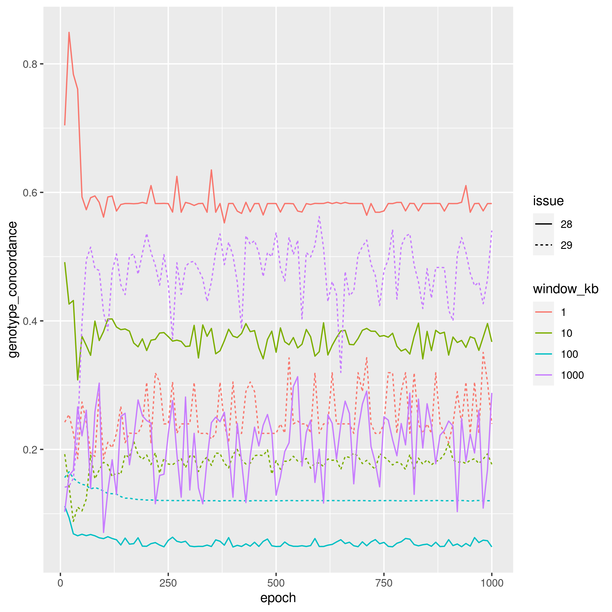
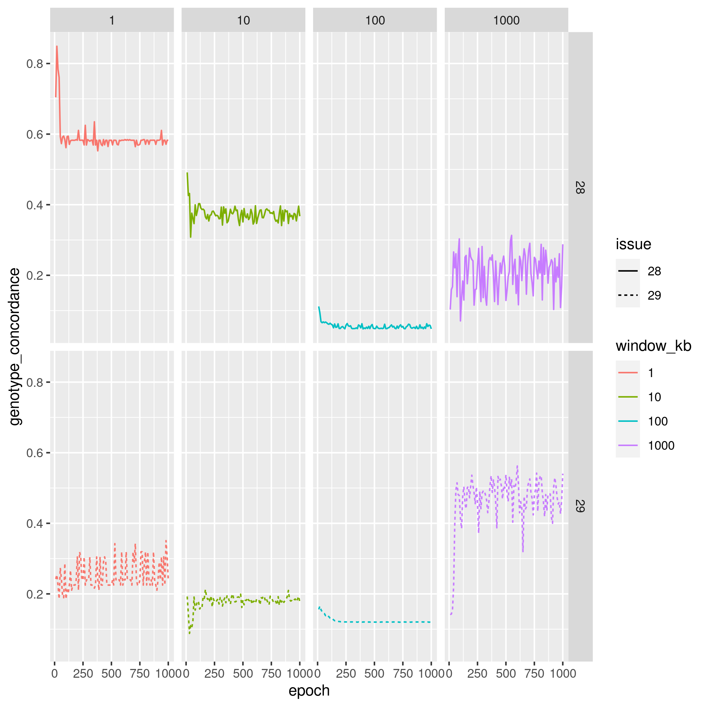
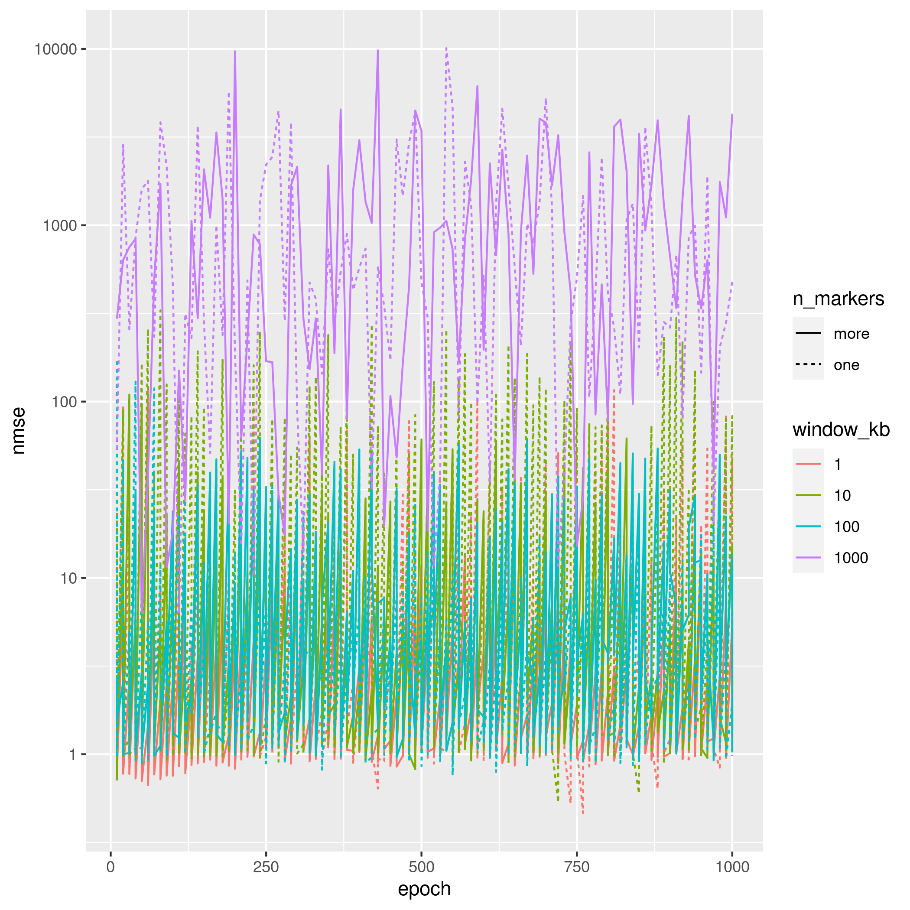
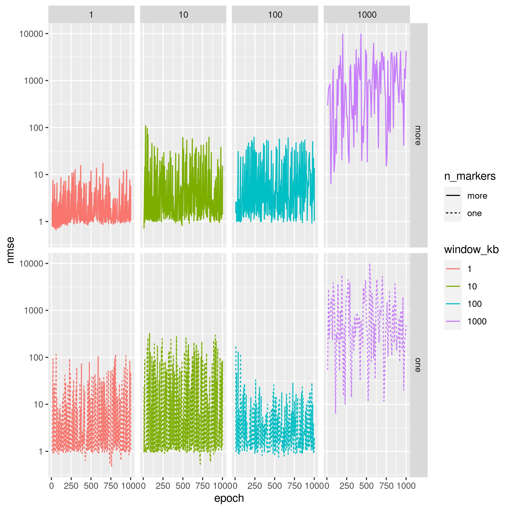
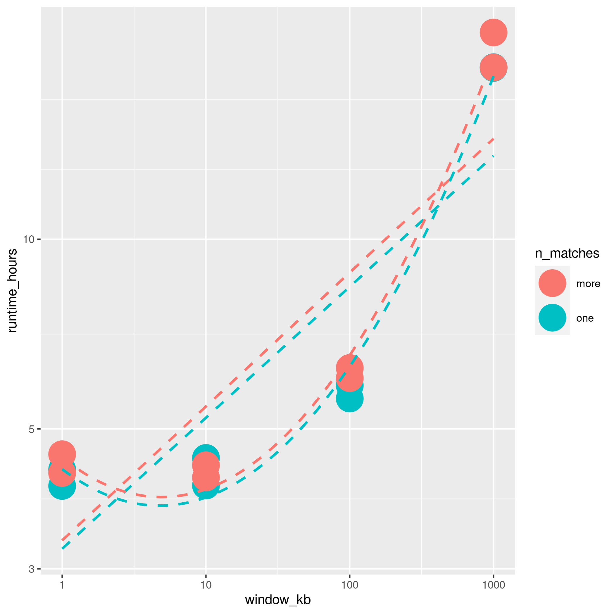

# nsphs_ml_qt_results

Results for nsphs_ml_qt.

## Issue 28 and 29

### Genotype concordance

A measure of how well the genotypes are compressed,
which is a value from 0 (worst) to 1 (best).

> Genotype concordance in one plot

> Genotype concordance in a facet grid

### Normalized mean squared error

A measure of the error in phenotype prediction,
which is a value from 0 (perfect prediction) to infinity (useless prediction).

> Normalized mean squared error in one plot

> Normalized mean squared error in a facet grid

### Runtime

> Duration of training in hours, with a linear and parabolic fit

